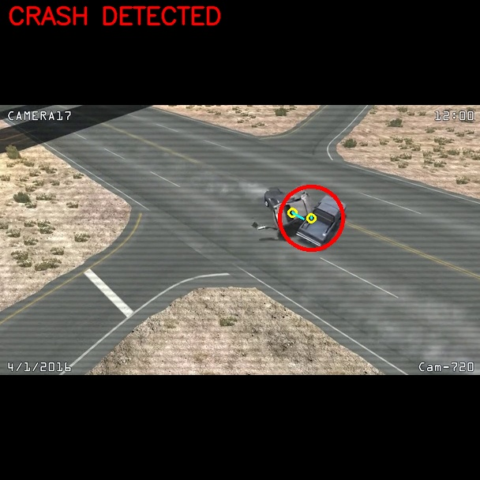
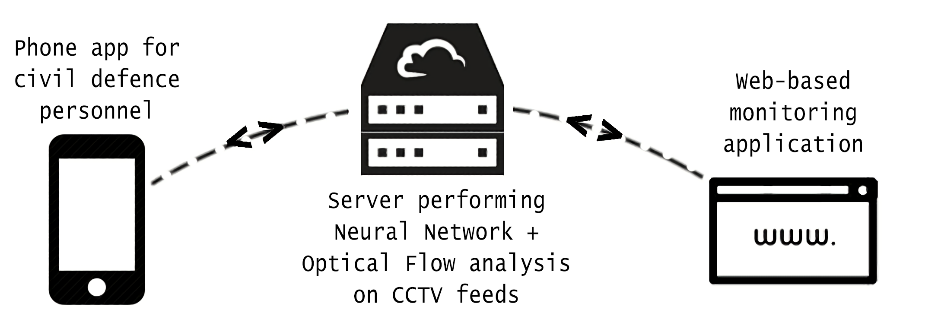
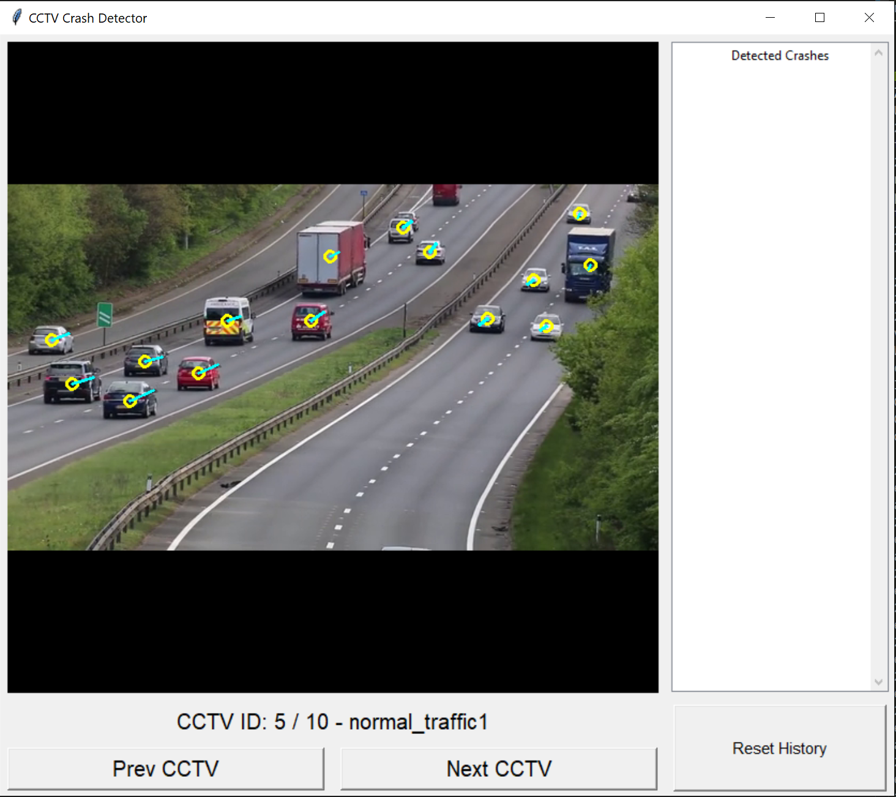

# CCTV Traffic Accident Detection - Team R-Cube
**Finalist for Singapore Computer Society's Splash Awards 2019**

This project uses Computer Vision, Deep Learning, and Artificial Intelligence to detect traffic accidents of high severity on a variety of roads and dynamic traffic conditions.

Submitted in the Splash Awards 2019, hosted by the Singapore Computer Society.
Team members: Raghav Bhardwaj, Rishi Mahadevan, Rishab Patwari

    

## Introduction

In Singapore, we are quite fortunate to have well-prepared emergency services that respond to traffic accidents at a moment’s notice. But what would happen in an incapacitating accident at 3 am with no bystanders to report it?

Our team, R-Cube, aims to answer this question by helping our target audience - SCDF & SPF - by using Machine Learning and Computer Vision to detect traffic accidents autonomously in a split second. Detecting otherwise unreported accidents will create safer roads and a more efficient system for the civil defense, devoid of human error.

Our solution is designed to be as effortless and inexpensive as possible to setup, especially since it will simply run on top of LTA's prexisting, pervasive road CCTV infrastructure. This keeps the costs of this solution very low as it does not require any dramatic paradigm shifts before it can be of use.

    

The key features of our solution include an immediate notification system that can autonomously detect potential accidents and can inform relevant SCDF or SPF personnel through a mobile or web alert. We believe this instantaenous feedback system can make all the difference between life and death in even the most severe and critical accidents.

## Libraries Used

* [Keras RetinaNet](https://github.com/fizyr/keras-retinanet/blob/master/README.md) - CNN used for vehicle detection
* [LabelImg](https://github.com/tzutalin/labelImg) - Used to label our custom dataset
* [OpenCV](https://opencv.org/) - Used for its various image annotation/drawing functions
* [Tkinter](https://tkdocs.com/) - Used to make serverside GUI
* [Flask](https://palletsprojects.com/p/flask/) - Used to make the backend run and the api gateway
## Technical Details

Essentially, our system detects vehicles every frame by using a Convolutional Neural Network (RetinaNet with a Resnet50 backbone to be specific) trained on a custom dataset. [The dataset we used can be found here](https://mega.nz/#F!wtdFEK5I!i-DhrihW2Gprb07xWHhlhQ). We then use a custom algorithm to perform object tracking across multiple frames and calculated each vehicle's velocity vector.

By comparing this velocity vector every frame, we are able to detect massive changes in velocity (high deceleration or acceleration) and can flag these as a suspected accident. The frame with the suspected accident is then stored on the server for SCDF or SPF staff to review, and a notification about the accident is sent via the Cloud to the mobile devices of any rescue personnel in the vicinity of the accident.

For our dataset we initially tried to use any images that contained vehicles from the [COCO Dataset](http://cocodataset.org/#download), however this gave us very inaccurate results since there was too much variation in how vehicles were labelled. One such example is when a single wheel was labelled as a car - multiple images such as these would definitely throw off our Neural Network's accuracy.

For our purpose we required a dataset in which we would view cars from an overhead angle, from a distance away. We were unable to find any reliable datasets, and so we created our own dataset of around 400 extracted frames from a combination of real-world CCTV camera footage and photo-realistic video-game footage. This dataset was later doubled since we introduced rotational invariance into our model by horizontally flipping our initial 400 images.

One thing we were unsure of initially was whether using video-game footage would affect our model's accuracy. However this was not the case as the video-game we used, BeamNG had a very accurate physics engine that mirrored the real world, and our model was able to generalize well with real-world footage:

    

The next issue we faced was a lack of high quality accident footage, as most of the crash compilations we found online had very low resolutions. This is where we decided to rely on BeamNG again, as [we found a channel that simulated realistic accidents in-game](https://www.youtube.com/channel/UCWjlKMwc6zf_0UuHJWUhWOA). 

Due to its accurate simulation of real-world physics, we decided to use these videos to test our accident detection, to very promising results! The following video shows the system in action:

## Installation and Setup Guide

Assuming that none of the pre-requisite libraries have been installed, please follow the instructions below to setup this project from scratch. In terms of hardware requirements, a powerful dedicated GPU is highly recommended, as CPU performance will be nowhere close to realtime.

Our hardware setup for this project is as follows:
* i7-8700K
* GTX 1080Ti
* 16GB RAM

This gives us an average framerate of about 26 FPS. Using an even higher end GPU should help push this framerate to a truly realtime performance of 30 FPS and beyond.

Please take note that these instructions are for Windows 10.

### Installing Python 3.6

* Install Python from the [official website](https://www.python.org/downloads/).
* During the installation, ensure that you check the box for installing `pip` alongside Python 3.6.
* Ensure Python 3.6 has been added to your path by opening a new terminal and entering `python --version`. This should report your Python version as 3.6.x.
* Run the following command in your terminal: `pip install --upgrade pip`
* Verify `pip` install by typing: `pip --version`

### Install Other Dependencies

* `pip install pillow`
* `pip install lxml`
* `pip install jupyter`
* `pip install matplotlib`

### Install Visual C++ 2015

* [Go to this site](https://visualstudio.microsoft.com/vs/older-downloads/)
* Select "Redistributables and Build Tools"
* Download 64-bit version of "Microsoft Visual C++ 2015 Redistributable Update 3"

### Ensure Long Paths are Enabled in Windows

* [Guide](https://superuser.com/questions/1119883/windows-10-enable-ntfs-long-paths-policy-option-missing)

### Update NVIDIA GPU Drivers

* [Driver Update](https://www.nvidia.com/Download/index.aspx?lang=en-us)

### Install CUDA 10.0

* [Download here](https://developer.nvidia.com/cuda-toolkit-archive)
* Install into the default directory.

### Install cuDNN 7.6.0

* You need a nvidia developer account for this step, but this is free and easy to make
* [Go to this link](https://developer.nvidia.com/cudnn) and click on "Download cuDNN" Make sure you download cuDNN 7.6.0 for CUDA 10.0 only. The download will be called "cuDNN Library for Windows 10.
* Extract the downloaded archive.
* Open your default CUDA installation directory: `C:\Program Files\NVIDIA GPU Computing Toolkit\CUDA\v10.0\`

In the cuDNN extracted folder, copy the following files to the following locations:
* `./cuda/bin/cudnn64_7.dll` to `C:/Program Files/NVIDIA GPU Computing Toolkit/CUDA/v10.0/bin/`
* `./cuda/include/cudnn.h` to `C:/Program Files/NVIDIA GPU Computing Toolkit/CUDA/v10.0/include/`
* `./cuda/lib/x64/cudnn.lib` to `C:/Program Files/NVIDIA GPU Computing Toolkit/CUDA/v10.0/lib/x64/`

### Add CUDA, cuDNN, Etc to System Path Environment Variables

Add the following entries:
* `C:\Program Files\NVIDIA GPU Computing Toolkit\CUDA\v10.0\bin`
* `C:\Program Files\NVIDIA GPU Computing Toolkit\CUDA\v10.0\extras\CUPTI\libx64`
* `C:\Program Files\NVIDIA GPU Computing Toolkit\CUDA\v10.0\include`

Now restart your PC

### Install Tensorflow-GPU

* Open a new terminal and run `pip install --user --upgrade tensorflow-gpu==1.13.1`
* Test installation: `python -c "import tensorflow as tf;print(tf.reduce_sum(tf.random.normal([1000, 1000])))"`

### Setting up this Repository

* `git clone https://github.com/Raghav-B/cctv_crash_detector` to your desired directory.
* `cd cctv_crash_detector/keras-retinanet`
* `pip install . --user` - This should install all remaining dependencies.
* `python setup.py build_ext --inplace`
* If you are missing any libraries later on, they should be fairly easy to install using `pip`.

### Getting Infernece Graph and Video Files

These files are too large to be uploaded to GitHub, so you'll have to download them yourself and place them inside the cloned repository.
* [Inference Graph](https://mega.nz/#!lkFDUaJQ!IpJ00KTEB1LG01XEYfApor9HNvADY391g9lE0baP6ns) - Place `.h5` file under `keras-retinanet/inference_graphs/`
* [Test Video Files](https://mega.nz/#F!11FBGQ7L!inYkskrFUJf-lP4AKVD0Iw) - Place `.mp4` files under `videos/`

### Running the Server

* Naviate to `demo/`
* `python cctv.py` to run.

### How does the backend work? 

We used flask to get the backend to work. We have hosted the backend on Google cloud platform and is accessible by http://34.66.101.75:5002. 

When you access the website, you will see tiles that represent the cctv's and when a crash is detected it turns red. When you click the 'camera' you can see the crash. 

Our analysis system analyses the frame and sends a request to our backend that stores the camera number and the picture in bytes. This is stored in a python dictionary. THe website has a javascript script that polls the backend for any new crashes, which is returned in a list. It changes the color of the tile depending on the number it recieves. 

